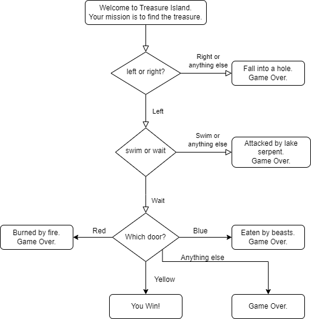

# Day 03: Treasure Island

## Description
The purpose of this project is to create an **exploration game**, in which the player choose options from a set of questions, and relies on luck to reach the end of the game.

The idea behind this challenge is to work with **conditional statements, logical operators and project scope creation**.

## Fluxogram


## How to Use
Execute the `main.py` script to start the game.

```sh
# Command to run the game
python main.py
```

## Author
Hyran Teixeira